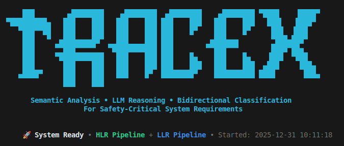

# TraceX : A Requirements Traceability Analysis System


[](https://www.python.org/downloads/)
[](https://opensource.org/licenses/MIT)
[](https://github.com/psf/black)

A sophisticated AI-powered system for bidirectional requirements traceability analysis in safety-critical systems. Uses semantic embeddings and LLM reasoning to automatically classify high-level requirements (HLRs) and low-level requirements (LLRs), ensuring complete and correct implementation chains.

---

## 📋 Table of Contents

- [Problem Statement](#-problem-statement)
- [Our Approach](#-our-approach)
- [Architecture](#-architecture)
- [Key Features](#-key-features)
- [Project Structure](#-project-structure)
- [Installation](#-installation)
- [Configuration](#-configuration)
- [Usage](#-usage)
- [Classification Taxonomy](#-classification-taxonomy)
- [Output Artifacts](#-output-artifacts)
- [Development](#-development)
- [Contributing](#-contributing)
- [License](#-license)

---

## 🎯 Problem Statement

### The Challenge

In safety-critical systems (aviation, automotive, medical devices), ensuring **complete traceability** between high-level requirements and their low-level implementations is not just a best practice—it's a regulatory requirement (DO-178C, ISO 26262, IEC 62304).

**Manual traceability analysis faces several challenges:**

1. **Scale**: Projects can have hundreds of HLRs and thousands of LLRs
2. **Semantic Gaps**: Simple keyword matching fails to capture semantic relationships
3. **Bidirectionality**: Must verify both HLR→LLR (coverage) and LLR→HLR (justification)
4. **Subjective Interpretation**: Different engineers may interpret relationships differently
5. **Maintenance Burden**: Requirements evolve, breaking existing trace links

### Real-World Impact

**Trace holes** (HLRs without sufficient LLR implementation) can lead to:
- Missing critical safety features
- Certification failures
- Costly late-stage rework

**Orphan requirements** (LLRs without HLR justification) can lead to:
- Feature creep and scope drift
- Unmaintained code
- Increased complexity without value

---

## 💡 Our Approach

We combine **semantic search** with **LLM reasoning** to automate traceability analysis:

### 1. Semantic Similarity (Fast Filtering)
- Use `sentence-transformers` to generate embeddings for all requirements
- FAISS vector search to quickly retrieve top-K candidates
- Captures semantic relationships beyond keyword matching

### 2. LLM Reasoning (Deep Analysis)
- Groq API with high-performance models for reasoning
- Analyzes each HLR-LLR pair for:
  - ✅ **Necessity**: Is the LLR required to satisfy the HLR?
  - 🛡️ **Safety Impact**: Does it prevent violations?
  - 🔒 **Constraint**: Does it constrain unsafe behavior?
  - ⚠️ **Extension**: Does it go beyond HLR intent?

### 3. Heuristic Classification (Robust Fallback)
- Rule-based classification using tuned thresholds
- Counts strong/medium/weak supporters
- Guarantees classification even if LLM fails

### 4. Bidirectional Analysis
- **HLR Analysis**: FULLY_TRACED / PARTIAL_TRACE / TRACE_HOLE
- **LLR Analysis**: COMPLIANT / AMBIGUOUS / UNJUSTIFIED / ORPHAN

---

## 🏗️ Architecture

```
┌─────────────────────────────────────────────────────────────────┐
│                     Requirements Input                          │
│              (HLRs: hlrs.json, LLRs: llrs.json)                │
└────────────────────────┬────────────────────────────────────────┘
                         │
                         ▼
┌─────────────────────────────────────────────────────────────────┐
│                  Embedding Generation                           │
│         sentence-transformers (all-MiniLM-L6-v2)               │
│              FAISS Indexing for Fast Search                     │
└────────────────────────┬────────────────────────────────────────┘
                         │
        ┌────────────────┴────────────────┐
        │                                  │
        ▼                                  ▼
┌──────────────────┐              ┌──────────────────┐
│  HLR Pipeline    │              │  LLR Pipeline    │
│                  │              │                  │
│ 1. Retrieve Top-K│              │ 1. Retrieve Top-K│
│    LLR Candidates│              │    HLR Candidates│
│                  │              │                  │
│ 2. LLM Reasoning │              │ 2. LLM Reasoning │
│    (Groq API)    │              │    (Groq API)    │
│                  │              │                  │
│ 3. Weight Calc   │              │ 3. Weight Calc   │
│    (sim + reason)│              │    (sim + reason)│
│                  │              │                  │
│ 4. Classification│              │ 4. Classification│
│    - FULLY_TRACED│              │    - COMPLIANT   │
│    - PARTIAL     │              │    - AMBIGUOUS   │
│    - TRACE_HOLE  │              │    - UNJUSTIFIED │
│                  │              │    - ORPHAN      │
└────────┬─────────┘              └────────┬─────────┘
         │                                  │
         └────────────────┬─────────────────┘
                          │
                          ▼
         ┌────────────────────────────────┐
         │     Output Generation          │
         │  - JSON summaries              │
         │  - Traceability graph (PNG)    │
         │  - Classification charts       │
         │  - Rich CLI output             │
         └────────────────────────────────┘
```

### Technology Stack

| Component | Technology | Purpose |
|-----------|-----------|---------|
| **Embeddings** | sentence-transformers (all-MiniLM-L6-v2) | Semantic similarity |
| **Vector Search** | FAISS | Fast top-K retrieval |
| **LLM Reasoning** | Groq API (openai/gpt-oss-120b) | Deep semantic analysis |
| **Structured Output** | Groq API (llama-3.1-8b-instant) | Deterministic classification |
| **Visualization** | NetworkX + Matplotlib | Traceability graphs |
| **CLI** | Rich library | Beautiful terminal output |
| **Package Manager** | uv | Fast Python packaging |

---

## ✨ Key Features

- ✅ **Bidirectional Analysis**: Both HLR→LLR and LLR→HLR directions
- 🧠 **Semantic Understanding**: Goes beyond keyword matching
- 🤖 **LLM-Powered Reasoning**: Deep analysis of requirement relationships
- 📊 **Visual Outputs**: Traceability graphs and classification charts
- 🎨 **Beautiful CLI**: Rich terminal interface with progress tracking
- ⚡ **Fast**: FAISS indexing for efficient candidate retrieval
- 🛡️ **Robust**: Heuristic fallback ensures classification always succeeds
- 🔧 **Configurable**: Tunable thresholds and parameters
- 📈 **Comprehensive Metrics**: Confidence scores, risk levels, and statistics

---

## 📁 Project Structure

```
reqs/
├── src/
│   ├── hlrs.json                    # High-Level Requirements test data
│   └── llrs.json                    # Low-Level Requirements test data
│
├── hlrs/                            # HLR Classification Pipeline
│   ├── __init__.py
│   ├── config.py                    # Configuration and thresholds
│   ├── embeddings.py                # Embedding generation + FAISS
│   ├── groq_client.py               # Groq API client with rate limiting
│   ├── hlr_classifier.py            # Core HLR classification logic
│   ├── main.py                      # HLR CLI interface
│   ├── output.py                    # Result formatting and saving
│   ├── prompts.py                   # LLM prompts for reasoning
│   └── visualizer.py                # Graph generation
│
├── llrs/                            # LLR Classification Pipeline
│   ├── __init__.py
│   ├── llr_classifier.py            # Core LLR classification logic
│   ├── output.py                    # LLR result formatting
│   └── prompts.py                   # LLR-specific prompts
│
├── dist/                            # Output directory (generated)
│   ├── hlrs-summary.json
│   ├── llrs-summary.json
│   ├── complete-traceability-analysis.json
│   ├── requirements-traceability-graph.png
│   └── classification-summary.png
│
├── run_complete_analysis.py         # Main entry point
├── pyproject.toml                   # Project dependencies
├── .env                             # API keys (not in git)
├── .gitignore
└── README.md
```

### Module Descriptions

#### `hlrs/` - HLR Analysis Pipeline
- **config.py**: Centralized configuration (thresholds, model names, API settings)
- **embeddings.py**: Generates embeddings and builds FAISS index for fast search
- **groq_client.py**: Wrapper for Groq API with rate limiting and retry logic
- **hlr_classifier.py**: Core classification logic with 3-step pipeline
- **prompts.py**: Prompt templates for LLM reasoning
- **output.py**: JSON serialization and rich terminal formatting
- **visualizer.py**: NetworkX-based graph visualization

#### `llrs/` - LLR Analysis Pipeline
- **llr_classifier.py**: LLR classification with 4-category taxonomy
- **prompts.py**: LLR-specific prompt engineering
- **output.py**: LLR result formatting

#### `src/` - Test Data
- **hlrs.json**: 6 sample HLRs from aviation domain
- **llrs.json**: 10 sample LLRs with varying relationships

---

## 🚀 Installation

### Prerequisites

- **Python 3.12+** (uses modern type hints and features)
- **uv** package manager (or pip as fallback)
- **Groq API key** (get from [console.groq.com](https://console.groq.com))

### Step 1: Clone Repository

```bash
git clone https://github.com/yourusername/reqs-traceability.git
cd reqs-traceability
```

### Step 2: Install uv (if not already installed)

```bash
# macOS/Linux
curl -LsSf https://astral.sh/uv/install.sh | sh

# Windows
powershell -c "irm https://astral.sh/uv/install.ps1 | iex"
```

### Step 3: Sync Dependencies

```bash
# Using uv (recommended - faster)
uv sync

# Or using pip
pip install -e .
```

This will install:
- `sentence-transformers` - Semantic embeddings
- `faiss-cpu` - Vector search
- `groq` - LLM API client
- `rich` - Beautiful terminal output
- `networkx` - Graph analysis
- `matplotlib` - Visualization
- `python-dotenv` - Environment variable management

### Step 4: Set Up Environment

Create a `.env` file in the project root:

```bash
# .env
GROQ_API_KEY=your_groq_api_key_here
```

**Get your Groq API key:**
1. Visit [console.groq.com](https://console.groq.com)
2. Sign up / Log in
3. Navigate to API Keys
4. Create new key and copy it

---

## ⚙️ Configuration

### Key Configuration Files

#### `hlrs/config.py` - Main Configuration

```python
# Similarity Thresholds
SIMILARITY_THRESHOLD_VERY_STRONG = 0.85  # Very strong relationship
SIMILARITY_THRESHOLD_STRONG = 0.70       # Strong relationship
SIMILARITY_THRESHOLD_MEDIUM = 0.45       # Medium relationship
SIMILARITY_THRESHOLD_WEAK = 0.30         # Weak but valid relationship

# Classification Thresholds
MIN_VERY_STRONG_FULLY_TRACED = 3         # Need 3 very strong LLRs
MIN_STRONG_TOTAL_PARTIAL_TRACE = 1       # 1-2 strong = PARTIAL_TRACE
MAX_STRONG_PARTIAL_TRACE = 2             # More than 2 → FULLY_TRACED

# LLM Models
REASONING_MODEL = "openai/gpt-oss-120b"  # Deep analysis
STRUCTURED_OUTPUT_MODEL = "llama-3.1-8b-instant"  # Classification

# Rate Limiting
RATE_LIMIT_DELAY = 0.8  # Seconds between API calls
MAX_RETRIES = 3         # Retry attempts on failure
```

### Tuning Thresholds

**If you find too many TRACE_HOLE classifications:**
- Lower `SIMILARITY_THRESHOLD_STRONG` (e.g., 0.65)
- Lower `MIN_VERY_STRONG_FULLY_TRACED` (e.g., 2)

**If you find too many FULLY_TRACED classifications:**
- Raise `SIMILARITY_THRESHOLD_VERY_STRONG` (e.g., 0.90)
- Raise `MIN_VERY_STRONG_FULLY_TRACED` (e.g., 4)

---

## 📖 Usage

### Basic Usage - Complete Analysis

Run the full bidirectional analysis:

```bash
uv run run_complete_analysis.py
```

This will:
1. Load HLRs and LLRs from `src/`
2. Generate embeddings and build FAISS index
3. Run HLR classification pipeline
4. Run LLR classification pipeline
5. Generate visualizations
6. Save results to `dist/`

### Expected Output


### HLR-Only Analysis

```bash
cd hlrs
uv run main.py
```

### LLR-Only Analysis

```bash
# Modify run_complete_analysis.py to skip HLR pipeline
# or create llrs/main.py similar to hlrs/main.py
```

### Custom Data

Replace `src/hlrs.json` and `src/llrs.json` with your own requirements:

```json
// hlrs.json
[
  {
    "id": "HLR001",
    "name": "Requirement Name",
    "description": "Detailed description",
    "embedding_text": "Combined text for embedding (name + description)"
  }
]

// llrs.json
[
  {
    "id": "LLR001",
    "name": "Implementation Name",
    "description": "Detailed implementation",
    "embedding_text": "Combined text for embedding"
  }
]
```

---

## 🏷️ Classification Taxonomy

### HLR Classifications

| Classification | Symbol | Meaning | Criteria |
|---------------|--------|---------|----------|
| **FULLY_TRACED** | ✅ | Complete traceability | ≥3 very strong LLR supporters OR (≥2 very strong + ≥3 total strong) |
| **PARTIAL_TRACE** | ⚠️ | Incomplete coverage | 1-2 strong LLRs but missing critical aspects |
| **TRACE_HOLE** | ❌ | Missing implementation | No meaningful LLR support found |

### LLR Classifications

| Classification | Symbol | Meaning | Criteria |
|---------------|--------|---------|----------|
| **COMPLIANT** | ✅ | Properly justified | Has 1+ strong HLR link and is necessary |
| **AMBIGUOUS** | ⚠️ | Unclear justification | Multiple weak links or single weak link |
| **UNJUSTIFIED** | 🔶 | Extends beyond intent | Has HLR link but goes beyond its scope |
| **ORPHAN** | 🔴 | No justification | No strong HLR justification found |

### Risk Levels

| Risk | HLR Classification | Impact |
|------|-------------------|--------|
| **HIGH** | TRACE_HOLE | Critical safety/functional gap |
| **MEDIUM** | PARTIAL_TRACE | Incomplete implementation |
| **LOW** | FULLY_TRACED | Adequate traceability |

---

## 📦 Output Artifacts

### 1. JSON Summaries

**`dist/hlrs-summary.json`**
```json
{
  "metadata": {
    "total_hlrs": 6,
    "fully_traced": 1,
    "partial_trace": 3,
    "trace_hole": 2
  },
  "results": [
    {
      "req_id": "HLR01",
      "classification": "FULLY_TRACED",
      "confidence_score": 0.95,
      "reasoning": {
        "summary": "HLR is well-decomposed...",
        "key_findings": ["..."],
        "gaps_identified": []
      },
      "linked_llrs": [...],
      "risk_level": "LOW"
    }
  ]
}
```

**`dist/llrs-summary.json`**
```json
{
  "metadata": {
    "total_llrs": 10,
    "compliant": 4,
    "ambiguous": 3,
    "unjustified": 1,
    "orphan": 2
  },
  "results": [...]
}
```

**`dist/complete-traceability-analysis.json`**
- Combined HLR + LLR results
- Timestamp and metadata
- Full bidirectional trace matrix

### 2. Visualizations

**`dist/requirements-traceability-graph.png`**
- Node types: HLRs (squares), LLRs (circles)
- Node colors: Green (traced/compliant), Orange (partial/ambiguous), Red (hole/orphan)
- Edge thickness: Proportional to weight/similarity
- Edge colors: Green (strong), Orange (medium), Red (weak)

**`dist/classification-summary.png`**
- Pie charts showing distribution of classifications
- Separate charts for HLRs and LLRs

---

## 🛠️ Development

### Running Tests

```bash
# Run all tests
uv run pytest

# Run with coverage
uv run pytest --cov=hlrs --cov=llrs --cov-report=html
```

### Code Formatting

```bash
# Format with black
uv run black .

# Check with flake8
uv run flake8 hlrs/ llrs/ run_complete_analysis.py
```

### Type Checking

```bash
uv run mypy hlrs/ llrs/
```

### Debugging

Enable verbose logging by modifying `hlrs/config.py`:

```python
DEBUG_MODE = True
VERBOSE_LOGGING = True
```

### Performance Profiling

```bash
# Profile execution time
uv run python -m cProfile -o output.prof run_complete_analysis.py

# Analyze with snakeviz
uv run snakeviz output.prof
```

---

## 🤝 Contributing

We welcome contributions! Here's how to get started:

### 1. Fork & Clone

```bash
git clone https://github.com/yourusername/reqs-traceability.git
cd reqs-traceability
git checkout -b feature/your-feature-name
```

### 2. Set Up Development Environment

```bash
uv sync
uv pip install -e ".[dev]"  # Install dev dependencies
```

### 3. Make Changes

- Follow existing code style (black formatting)
- Add docstrings to all functions
- Update tests for new features
- Keep functions focused and modular

### 4. Test Your Changes

```bash
uv run pytest
uv run black --check .
uv run mypy hlrs/ llrs/
```

### 5. Submit Pull Request

- Write clear commit messages
- Reference any related issues
- Provide before/after examples
- Update documentation if needed

### Code Style Guidelines

- **Formatting**: Use `black` with default settings
- **Imports**: Group standard lib, third-party, local
- **Type Hints**: Use for all function signatures
- **Docstrings**: Google-style docstrings
- **Naming**: 
  - `snake_case` for functions/variables
  - `PascalCase` for classes
  - `UPPER_CASE` for constants

### Areas for Contribution

- 🧪 **Testing**: Expand test coverage
- 📚 **Documentation**: Add more examples and tutorials
- 🎨 **Visualization**: Improve graph layouts and styling
- 🔧 **Configuration**: Add more tunable parameters
- 🌐 **API**: RESTful API wrapper
- 📊 **Metrics**: Additional traceability metrics
- 🔌 **Integrations**: Jira, Azure DevOps, Polarion connectors

---

## 📊 Performance Benchmarks

| Metric | Value |
|--------|-------|
| **Embedding Generation** | ~50ms per requirement |
| **FAISS Indexing** | <100ms for 1000 requirements |
| **Top-K Retrieval** | <10ms per query |
| **LLM Reasoning** | ~1-2s per HLR-LLR pair |
| **Total Analysis Time** | ~5-10 minutes for 100 HLRs × 500 LLRs |

**Note**: LLM reasoning time depends on Groq API latency and rate limits.

---

## 🔐 Security & Privacy

- **API Keys**: Never commit `.env` file to git
- **Data Privacy**: All data processed locally except LLM API calls
- **Rate Limiting**: Built-in to prevent API abuse
- **Retry Logic**: Exponential backoff for failed requests

---

## 📄 License

This project is licensed under the MIT License - see the [LICENSE](LICENSE) file for details.

```
MIT License

Copyright (c) 2025 [Your Name]

Permission is hereby granted, free of charge, to any person obtaining a copy
of this software and associated documentation files (the "Software"), to deal
in the Software without restriction...
```

---

## 🗺️ Roadmap

### v1.1 (Q1 2025)
- [ ] RESTful API wrapper
- [ ] Web dashboard for visualization
- [ ] Jira/Azure DevOps integration
- [ ] Batch processing mode

### v1.2 (Q2 2025)
- [ ] Custom embedding model fine-tuning
- [ ] Multi-language support
- [ ] Historical trend analysis
- [ ] Automated report generation (PDF)

### v2.0 (Q3 2025)
- [ ] Real-time traceability monitoring
- [ ] Change impact analysis
- [ ] Requirements quality scoring
- [ ] Team collaboration features

---

## 📚 Additional Resources

- [DO-178C Standard](https://en.wikipedia.org/wiki/DO-178C) - Software for Aviation
- [ISO 26262](https://www.iso.org/standard/68383.html) - Automotive Safety
- [Requirements Traceability Best Practices](https://example.com)
- [Semantic Search in NLP](https://example.com)

---